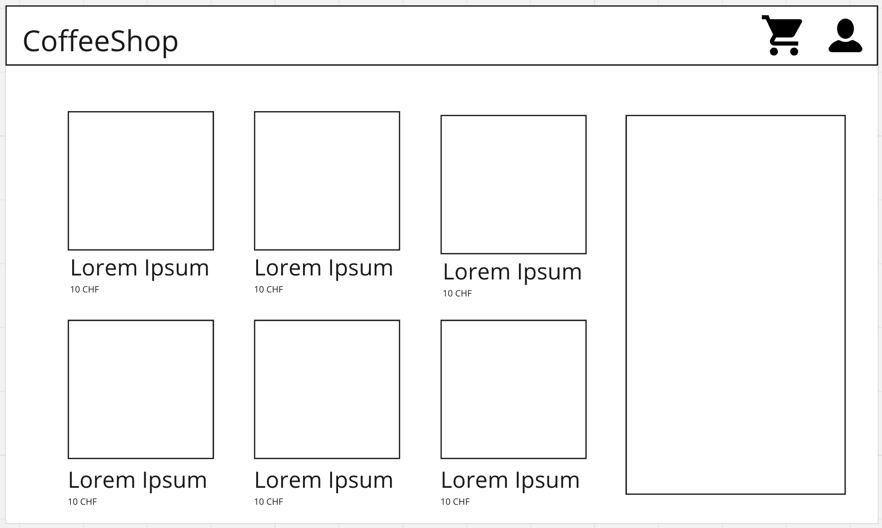

# Konzept: CoffeeShop

## Ziele

Unser Hauptziel ist es, Kunden hochwertige Kaffee-Produkte anzubieten und ein authentisches Kaffee-Erlebnis zu bieten. 
Wir möchten eine breite Auswahl an Produkten und Zubehör verkaufen.

## Produkte: 

Unser Shop wird eine breite Palette von Kaffee-Produkten anbieten, darunter:

- **Kaffeebohnen**: Verschiedene Kaffeesorten aus verschiedenen Regionen der Welt, um den individuellen Geschmack der Kunden zu befriedigen.
- **Gemahlener** Kaffee: Für Kunden, die Bequemlichkeit bevorzugen.
- **Espresso**- und Kaffeemaschinen: Hochwertige Maschinen für die Zubereitung von Espresso, Filterkaffee und anderen Kaffeevariationen.
- **Kaffeemaschinen**-Zubehör: Tassen, Mühlen, Filter und andere Zubehörteile für die perfekte Kaffeezubereitung.
- **Kaffeebecher** und Geschirr: Eine Auswahl an stilvollen und funktionalen Tassen und Geschirr für den Kaffeegenuss zu Hause.
- **Kaffee-Geschenksets**: Geschenkoptionen für Kaffeeliebhaber, darunter Geschenkkörbe und Geschenkgutscheine.

## Mockups

Hier ein sehr grobs Mockup unseres Shops

